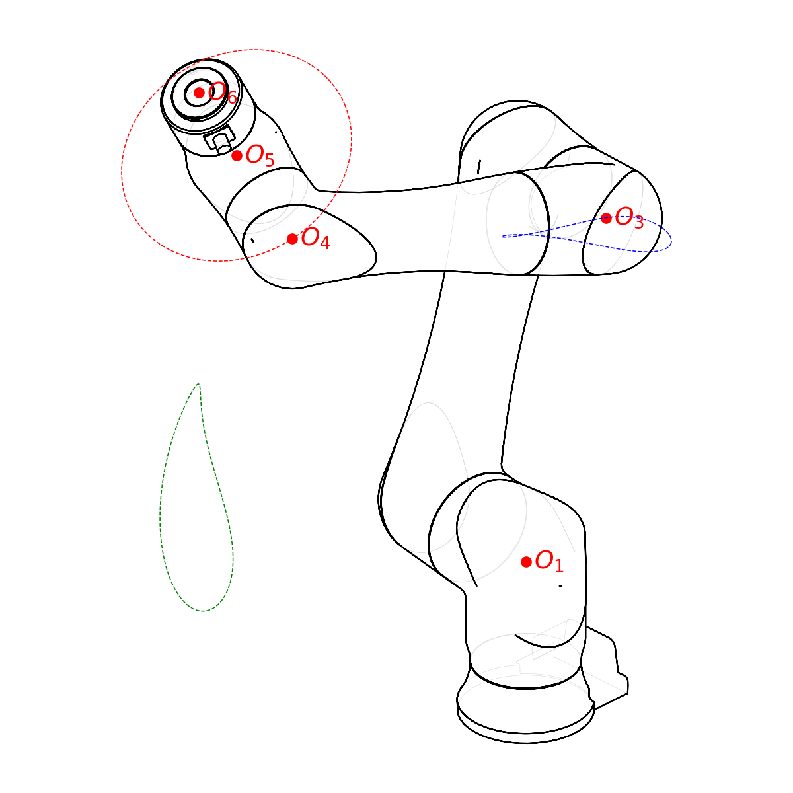

# FANUC CRX Series Inverse Kinematics

This repository contains the derivation of a general inverse kinematics model for the entire family of FANUC CRX collaborative robots based on the paper by Abbes and Poisson[^abbes] titled "Geometric Approach for Inverse Kinematics of the FANUC CRX Collaborative Robot." 
The paper provides a geometry-based framework for calculating joint positions for any robot with the CRX layout when given a desired pose at the robot flange, and can handle calculating the up-to-16 different redundant joint configurations which can produce that pose.

The main content of this repository is this README file.  The Python code contains a reference implementation and the scripts used to generate the diagrams.  If you want to _use_ the inverse kinematics models for this family of robots, there will be a Rust language implementation with a Python binary extension module.

## Quick Overview

The FANUC CRX series is a relatively new line of collaborative industrial robot arm with a traditional 6-axis serial layout but forgoing the spherical wrist.
The first model, the CRX-10iA was introduced in 2019, and currently (2025) there are six total kinematically unique models, plus a number of food-safe variants and a paint version of the 10iA/L.
All robots in the series have the same kinematic layout, varying only in link lengths. 

Because of the non-spherical wrist and the parallel J2/J3 axes, there aren't any pure analytical general solutions to the CRX inverse kinematics.
With FANUC robots, like most industrial arms, there are multiple joint configurations that can achieve most end effector poses and they must be accounted for during linear motion, meaning that most naive solver-based IK approaches require extra complexity.  The approach provided by Abbes and Poisson offers an intuitive, alternative method.

The general approach by Abbes and Poisson is based on the following observations:

1. Because of the offset wrist, for any desired pose at the flange, the origin of joint four $O_4$ must lie somewhere on a circular trajectory centered at $O_5$, with a radius equal to the wrist offset distance, and in a plane parallel to the robot flange.
2. $O_1$ will always be at the origin $(0, 0, 0)$ and $O_3$ and $O_4$ must always lie in a plane $P$ that contains the $z$ axis.
3. Thus, for any candidate $O_4$ position along the circle, there may be $0$, $1$, or $2$ candidate $O_3$ positions, located at the intersection of two circles in the plane $P$ defined by the $z$ axis and the candidate $O_4$. The radii of the two circles are the lengths of the arm and the forearm.
4. Because the physical construction of the elbow, forearm, and wrist, the vectors $\overrightarrow{O_3 O_4}$ and $\overrightarrow{O_4 O_5}$ will always be perpendicular. Abbes and Poisson make use of this by finding where their dot products are zero. Alternately, $O_3$, $O_4$, and $O_5$ will always be the corners of a right triangle, and so another approach is possible by finding where the distance between $O_5$ and $O_3$ matches the expected distance for the robot model.
5. Each pair of valid (as defined by #2 and #3) $O_3$ and $O_4$ positions corresponds with a kinematic configuration of the robot which can meet the desired end pose.  From the locations of $O_6$ (defined by the desired pose), $O_4$, and $O_3$ the joint angles can be trivially extracted.

This approach will be covered in more detail in the following sections.

## Background Principles and Primer

This section has a basic treatment of some kinematic principles, specifically trying to bridge the gap between FANUC robot controller concepts and the underlying mathematical ideas needed to work with them.  There is often a slight mismatch in language, or opaqueness in how FANUC thinks about each concept, that can make it hard to figure out what things actually mean and how to use them.

If you're an expert with both FANUC arms and kinematics, this section probably won't be useful to you.  If you have a strong background in one but not the other, or no background in either, this might be worth reading.

**Note: when FANUC refers to a cartesian "position" of the robot in a program, position register, or live on the robot, they don't mean it the way we typically use that word in engineering or robotics.  Rather than just a set of $x, y, z$ coordinates, they mean a full 6-DOF specification of both location and orientation. This can be confusing for people new to FANUC. When I use the word "position" in this document, I will typically be using it the way that FANUC uses it in sections referencing FANUC concepts, using the word "location" instead to refer to $x, y, z$ coordinates only. When discussing kinematics in later sections, I will try to substitute "position" with the less ambiguous "pose", but it will still mean location + orientation.**

### Frames, Positions, Offsets, and Isometries

When working with FANUC industrial robots, there are several concepts that show up repeatedly:

- Frames, which have two types:
    - User Frames, which typically are used to define local work offsets to make setup and programming easier. 
    - Tool Frames, which define a Tool Center Point (TCP), the point of interest which the robot controls during linear and arc moves and which is linked to stored positions.
- The world coordinate system, usually User Frame 0, which is the default coordinate system the robot references when moving to and displaying positions, and can be thought of as the global origin for the robot sitting at the intersection of the J1 and J2 axes with $\vec{z}$ pointing up and $\vec{x}$ pointing forward.
- Positions, stored both locally in programs and in the global position registers, which represent a desired location and orientation for the Tool Center Point in relation to a User Frame or the world coordinate system.
- Offsets, typically used to add fine adjustments to a position.

_All of these concepts are mathematically the_ exact _same thing._

Tool frames, user frames, positions, position registers, offsets, and the world coordinate system are each, under the hood, a rigid-body transformation...also known as an _isometry_, a Euclidean transformation, or an Euclidean isometry.  

For anyone familiar with linear algebra or computational geometry, _isometries_ are a special class of transformation which preserve distance: every pair of points in the original space has the same distance between them after being transformed. This excludes any scaling and shearing, and for the purposes of working with robots in the real world it also excludes reflection of any sort.  Instead, an _isometry_ is...at most...a rotation followed by a translation.

Because an _isometry_ can completely describe any arbitrary change in location and orientation, they are perfect for representing coordinate systems, poses ($x, y, z$ location + orientation) in space for objects and/or the robot's TCP, and adjustments made to positions or coordinate systems to move or rotate them slightly.

In the R-30iB controller, User Frames, Tool Frames, Positions (`CARTESIAN`, not `JOINT`), and offsets will all be stored in the same way: as a set of six numbers consisting of an X, Y, Z for translation and a W, P, R for rotations.  If you aren't familiar with this notation, it will be covered in the [XYZWPR](#xyzwpr-representation-of-isometries) section.

Though they are stored the same way and are mathematically identical, frames/positions/etc are conceptually different in how they are used/consumed by the robot controller.

- User Frames are isometries applied to the world coordinate system (the robot origin), setting the reference from which positions will be recorded or the current cartesian position of the TCP will be displayed.  When adjusted, every position referencing them will move in the physical world without having to be updated.
- Tool Frames are isometries applied to the end of the robot flange, moving the $x, y, z$ location of the Tool Center Point and adjusting the orientation of the tool's cardinal axes.
- Positions are _recorded_ by extracting and saving the isometry between the active User Frame isometry and the isometry describing the current location and orientation of the TCP. When the robot is instructed to _move to_ a position, its isometry is applied to the User Frame and the robot will work out where to move the joints so that the TCP matches with the result.
- Offsets are usually small adjustments that can be applied to a destination position in a program, typically to "touch up" an important location without modifying the original position or position register.  The isometry of the offset is applied to the position being adjusted before the robot is instructed to move to it.

There is one last isometry which is always changing and is usually only referenced indirectly. It is the kinematic isometry: the transformation that describes relationship between the world origin and the location + orientation of the robot flange.  The kinematic isometry is a function of the six joint angles, and every unique combination of joint angles has exactly one isometry associated with it, which can be computed by calculating the forward kinematics of the robot.  However, this isometry is not necessarily unique to the joint angles, and in most cases there are at least two different sets of joint angles which can achieve an isometry within the robot reach.

- The kinematic isometry is what you see on the controller's Teach Pendant when watch the robot's current position in world cartesian mode with an empty Tool Frame.
- _Forward_ kinematics is the process of taking the six joint angles and computing the kinematic isometry.
- _Inverse_ kinematics is the the process of taking a desired kinematic isometry and back-calculating the different combinations of joint angles which could achieve it.

### Mathematical Use of Isometries

In three dimensional space $\mathbb{R^3}$ isometries can be stored in 4x4 matrices, allowing them to be composed together by multiplication or inverted to reverse their effects.  When working directly on a FANUC controller, such as the R-30iB Mini Plus used by the smaller CRX models, the controller has its own kinematics model and will be multiplying isometries together internally and you will never see them.  

When trying to construct an external kinematics model yourself, or trying to simulate the robot's behavior in your programming language of choice, you will need to be able to work directly with isometries using at least the following operations:

1. Multiply isometries together to create a new isometry
2. Generate valid isometries from pure rotations and pure translations
3. Invert an isometry (find the isometry that when multiplied by the original creates the identity isometry)
4. Convert to and from FANUC's XYZWPR representation

Different programming languages have different libraries which can be used. I have used all of the following, but there are many options across many languages:

- Python: `scipy.spatial` has some transformation primitives, or `numpy` can be used by working directly with 4x4 matrices
- C++: the `eigen` library has both non-matrix abstract transforms (quaternions, translations, etc) and the matrix-based `Transform` class
- C#: the `Mathnet.Spatial` library has the `CoordinateSystem` class, which uses an underlying matrix representation
- Rust: the `nalgebra` library has a generic `Isometry<...>` struct, which can be used with `f32` or `f64` numbers and in three dimensions uses a unit quaternion to represent rotation.

#### Simplified Concepts

If you are familiar with using isometries or transformation matrices you can skip this section.

If you are unfamiliar, consider the following simplified model: an isometry is the 6-DOF analogue to a 3D vector.

- You can use them to represent both a place in space (a point), or a modification to a place in space (a translation vector).
- You can both combine them and find the difference between them.
- You can negate them so that they point in the other direction. If you combine one with its negation you get something representing zero.
- You can build them out of individual, lower DOF components.

If you have a set of isometries composed entirely of translations, without any rotations, they will work identically to 3D vectors.
Where the analogy falls apart is commutativity; the rotation component means that the order matters.

| Vector Operation              | Isometry Operation                      | Description                                                        |
|-------------------------------|-----------------------------------------|--------------------------------------------------------------------|
| $\vec{c} = \vec{a} + \vec{b}$ | $C = B \times A$                        | Take $a$ and move it by $b$ to create $c$                          |
| $-1 \cdot \vec{a}$            | $A^{-1}$                                | Invert/negate $a$                                                  |
| $0 = \vec{a} - \vec{a}$       | $I = A \times A^{-1} = A^{-1} \times A$ | Combining $a$ with its negative/inverse produces a neutral value   |
| $\vec{c} = \vec{a} - \vec{b}$ | $C = B^{-1} \times A$                   | Take $a$ and move it by the negative/inverse of $b$ to create $c$. |

For isometries, there is an isometry called the "identity" isometry that doesn't modify another isometry when multiplied.  In a matrix representation, it's an identity matrix.  It's also the implicit world origin, with the first three columns representing the $\vec{x}$, $\vec{y}$, and $\vec{z}$ unit vectors of the principle cartesian axes and the first three rows of column 3 representing the $t_x$, $t_y$, and $t_z$ translations applied when multiplying by this isometry.

$$
I = \begin{bmatrix}
    1 & 0 & 0 & 0 \\
    0 & 1 & 0 & 0 \\
    0 & 0 & 1 & 0 \\
    0 & 0 & 0 & 1 \\
    \end{bmatrix}
$$

Conceptually, transforming something by an isometry $T$ is moving it in space so that its current relation to the world origin $I$ is now the exact relationship it has to $T$.  Transformations (as matrix multiplications) are read from right to left. 

The following assignment first takes $A$ as it is in the world origin and moves it so that $B$ is its origin, then takes the product and moves it so that $C$ is the product's origin.  $A$ is moved by $B$, then the result is moved by $C$.

$$
D = C \times B \times A
$$

When composing an isometry from a translation and a rotation, the convention is to apply the rotation first, then the translation.

$$
A = T \times R
$$

### XYZWPR Representation of Isometries

To represent isometries for frames, positions, and offsets FANUC uses a shortened, mostly-unambiguous representation of an isometry based on Euler angles.  The letters WPR stand for yaW, Pitch, Roll, respectively.  In FANUC's definition, yaw is rotation around the X axis, pitch is around the Y axis, and roll is around the Z axis.  The X, Y, and Z values are in millimeters, and the W, P, R values are in degrees.

### The Forward Kinematic Loop

### FANUC Joint Configurations

## The CRX Kinematic Layout

[^abbes]: Abbes, Manel, and Gérard Poisson. "Geometric Approach for Inverse Kinematics of the FANUC CRX Collaborative Robot." Robotics 13, no. 6 (June 14, 2024): 91. https://doi.org/10.3390/robotics13060091.