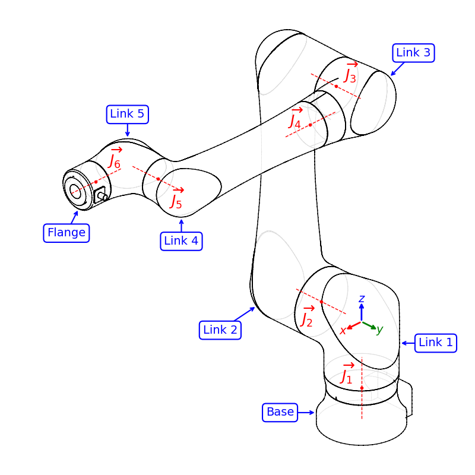

# Alternate Method

## Derivation of an Alternate Solution

### Constraints on a Solution

For any solution to be valid, it must satisfy all the following geometric constraints:

|   | Constraint                                                                                                           | Explanation                                                                                                                                                                                                                                              |
|---|----------------------------------------------------------------------------------------------------------------------|----------------------------------------------------------------------------------------------------------------------------------------------------------------------------------------------------------------------------------------------------------|
| A | The distance from $O_3$ to $O_1$ must be equal to $z_1$                                                              | This distance is controlled by Link 2, a single rigid body.                                                                                                                                                                                              |
| B | The distance from $O_3$ to $O_4$ must be equal to $x_1$                                                              | This distance is controlled by Link 3 and Link 4, and the distance does not change with $\overrightarrow{J_4}$ rotation.                                                                                                                                 |
| C | The distance from $O_4$ to $O_5$ must be equal to $y_1$                                                              | This distance is controlled by Link 4 and Link 5, and the distance does not change with $\overrightarrow{J_5}$ rotation.                                                                                                                                 |
| D | The cross-product of the vectors $\overrightarrow{O_1O_3}$ and $\overrightarrow{O_1O_4}$ have a z component of zero. | Because of how the robot is constructed, no matter how $\overrightarrow{J_1}$, $\overrightarrow{J_2}$, $\overrightarrow{J_3}$, and $\overrightarrow{J_4}$ rotate, $O_1$, $O_3$, and $O_4$ are always in the same vertical plane containing the $Z$ axis. |
| E | The vectors $\overrightarrow{O_4O_5}$ and $\overrightarrow{O_4O_3}$ are perpendicular.                               | Link 4 and Link 5 are constructed at a right angle.                                                                                                                                                                                                      |

### Initial Problem Setup

From the known geometric constraints, we can start to put together an intuition for the physical layout of the inverse kinematics problem.

First, during inverse kinematics, we are supplied a desired coordinate frame (isometry) at the end of the robot flange.  Thus, the frame of the last link is already known, including its origin $O_6$. This also means that the _origin_ of the 5th kinematic frame, $O_5$, is also known, since it is a simple offset from the end of the flange and is unaffected by $\overrightarrow{J_6}$ rotation.

We also know the position of $O_1$, because it is the origin of the world coordinate system, and it does not change regardless of what the robot's joints are doing. Thus, we already know the positions of $O_1$, $O_5$, and $O_6$, and the IK problem only requires us to find valid positions of $O_3$ and $O_4$ before backcalulating the joint angles which would achieve them.

Working backwards from the robot flange, Link 5 is the next link, connected to the flange through $\overrightarrow{J_6}$. This joint is aligned with the axis of the flange, and as it rotates, the position of $O_4$ will trace a single circle in space around $O_5$. This circle is the set of all possible locations of $O_4$ that do not violate Constraint C for the desired IK solution. This is one of the key insights of Abbes and Poisson.

We notice that, because of Constraint E, the distance between $O_5$ and $O_3$ is also constant, with a value of $\sqrt{x_1^2 + y_1^2}$. This means that the position of $O_3$ must, by definition, lie on the surface of a sphere centered around $O_5$.

However, $O_3$ must also be a fixed distance from $O_1$ because of Constraint A, so its position must also lie on the surface of a sphere with radius $z_1$ centered at $O_1$ (the world origin). To satisfy both Constraint A and Constraint E simultaneously, the set of possible $O_3$ points is the intersection of these two spheres, which is a circle centered on, and perpendicular to, the vector $\overrightarrow{O_1 O_5}$.

At this point we've run out of easy geometric simplifications. We have the circle $\mathcal{C}_4$ containing possible candidates for $O_4$ and another circle $\mathcal{C}_3$ containing possible candidates for $O_3$.

$$ O_3 \in \mathcal{C}_3 $$
$$ O_4 \in \mathcal{C}_4 $$

The relationship between possible values of $O_3$ and $O_4$ is the distance Constraint B, specifying that they must be $x_1$ apart, and the plane constraint D which forces $O_3$ and $O_4$ to be in a single plane containing the $Z$ axis.  To go further, we must be able to match points between $C_3$ and $C_4$ and check their cross-products, searching for zeros.

### Simplifying the $O_4$ to $O_3$ Matching Problem

For any candidate point $\hat{O}_4$ there are zero, one, or two possible points in $\mathcal{C}_3$ that may satisfy both the distance Constraint B and the perpinducualrity Constraint E. Geometrically we can think of this as creating a plane containing $\hat{O}_4$, with a normal of $\overrightarrow{O_5 \hat{O}_4}$ and taking its intersection with circle $\mathcal{C}_3$. 

The problem of finding valid pairs $(O_3, O_4)$ will eventually become a computational search. We could naively begin a very dense check of points in $\mathcal{C}_4$ using plane intersections with $\mathcal{C}_3$ and try to identify pairs that satisfy the planar Constraint D. However, at this point we do not fully understand the behavior of the relation, and so we do not know how dense that search would need to be.

Instead, we can further reduce the problem to one that is both easier to understand and faster to perform computations in.  We start with the following observations:

1. The center of circle $\mathcal{C}_3$ must always lie on a line between $O_1$ and $O_5$, because it was created by an intersection of two spheres with those centerpoints.
2. For the same reason, the normal of the circle $\mathcal{C}_3$ must always be perpendicular to the vector $\overrightarrow{O_1 O_5}$.
3. Consider that circle $\mathcal{C}_4$ with $(r=y_1, c=O_5)$ is a subset of a sphere $\mathcal{S}_4$ with $(r=x_1, c=O_5)$. The arrangement of $\mathcal{C}_3$ and $\mathcal{S}_4$ is axisymmetric and is uniquely defined by only three parameters:
   - The radius $r_3$ of $\mathcal{C}_3$
   - The distance of $O_5$ from the center of $\mathcal{C}_3$
   - The radius of $\mathcal{S}_4$, which is $y_1$ and always the same for all possible solutions on a single robot
4. Since the circle $\mathcal{C}_4$ is a set of surface points at the intersection of $\mathcal{S}_4$ and an arbitrary plane passing through its center, the circle breaks the axisymmetry. However, the nature of a circle means that it still retains symmetry across at least one plane that passes through $\overrightarrow{O_1 O_5}$

There are only two possible cases for the last item:

1. The normal of circle $\mathcal{C}_4$ is parallel to the normal of $\mathcal{C}_3$ and the entire configuration is axisymmetric.
2. The angle between the normal of circle $\mathcal{C}_4$ and the normal of $\mathcal{C}_3$ is in the interval $(0, \pi/2]$, and so the configuration is symmetric about the plane passing through both $\overrightarrow{O_1 O_5}$ and the normal of $\mathcal{C}_4$.

In the former case, a single matching of any arbitrary candidate point $\hat{O}_4$ to its corresponding points in $\mathcal{C}_3$ can be calculated and then rotated about $\overrightarrow{O_1 O_5}$ to represent any other match.  

In the latter case, we can shuffle the problem into a different geometric arrangement defined by the following parameters:

- $r_3$: the radius of $\mathcal{C}_3$
- $h$: the distance of $O_5$ from the center of $\mathcal{C}_3$
- $y_1$: the kinematic parameter of the robot
- $\phi$: the angle between the normal of $\mathcal{C}_4$ and the normal of $\mathcal{C}_3$

The reformulated problem consists of a circle on the $XY$ plane of radius $r_3$ centered at the origin $(0, 0, 0)$, and a circle of radius $y_1$ centered at $(0, 0, h)$, rotated about the $Y$ direction by $\phi$, such that the lowest point of the circle is always in the $+X$ direction (unless $\phi=\pi / 2$).

Importantly, there is an easily calculated isometry that can transform entities from the world coordinate system to the reduced problem coordinate system and back again, allowing us to transform the original world $Z$ axis into the reduced problem space to check against Constraint D, and then to move valid $(O_3, O_4)$ pairs back out into the world coordinate system for calculating joint angles.

### Working in the Simplified $O_4$ to $O_3$ Problem Space

In the simplified problem space, the original origin and $Z$ axis are now at some arbitrary position $O'$, and orientation $\overrightarrow{Z}'$, but the rest of the entities are symmetrical about the $XZ$ plane and all located near the origin.

- Circle $\mathcal{C}_3$ is now a circle of radius $r_3$ in the $XY$ plane, centered at $(0, 0, 0)$ 
- Circle $\mathcal{C}_4$ is now a circle of radius $y_1$, centered at $c_4 = (0, 0, h)$, rotated about the $Y$ direction by $\phi$

If we define further define circle $\mathcal{C}_4$ as having a $\theta_0$ angle corresponding with the $+X$ direction, then any candidate point can be defined as a function $\hat{O}_4(\theta)$, and corresponding points in $\mathcal{C}_3$ can be found by plane intersections.

We will call these points $\hat{O}_{3i}(\theta)$.

For any candidate point $\hat{O}_4(\theta)$: 

- There is a projection of that point onto the $XY$ plane forming vector $\overrightarrow{p}$
- There is a plane $P$ passing through $\hat{O}_4(\theta)$ with normal $\overrightarrow{c_4 \hat{O}_4(\theta)}$
- There are zero, one, or two points $\hat{O}_{3i}(\theta)$ in $\mathcal{C}_3$ that intersect with $P$. If there are two points, one will be clockwise from $\overrightarrow{p}$ and the other anticlockwise. If there are two points they will be symmetric about $\overrightarrow{p}$, becoming a single point at $\overrightarrow{p}$ in the 1-intersection case.

The distance relation between $\hat{O}_4(\theta)$ and its corresponding points means that smooth, continuous changes of $\theta$ will result in smooth, continuous changes of $\hat{O}_{3i}(\theta)$. This implies that the derivative of the $Z'$ component of $\overrightarrow{O' \hat{O}_4(\theta)} \times O' \overrightarrow{\hat{O}_{3i}(\theta)}$ is also smooth and continuous.  However, we will still need to perform a thoughtful search if we don't want to miss zeros.

There are a few more things that we can consider:

- Because the simplified problem space is symmetric across the $XZ$ plane, the corresponding points $\hat{O}_{3i}(-\theta)$ can always be found by taking $\hat{O}_{3i}(\theta)$ and inverting the point's $y$ component.  Clockwise points will become anticlockwise, and vice versa.
- We have oversimplified circles $\mathcal{C}_3$ and $\mathcal{C}_4$ up to this point; in reality, they do not necessarily represent _all_ possible allowable positions for $O_3$ and $O_4$, respectively.
    - The rotation of $O_3$ around $O_4$ as it rotates around $O_5$ does not form a _full_ sphere as described in the initial problem setup. Instead, it forms a sphere with a hole of diameter $y_1$ on both sides. Alternately, it can be conceptualized as the sphere stops existing beyond the planes parallel to $\mathcal{C}_4$ by $\pm x_1$. 
    - As the height $h$ increases, the circle $\mathcal{C}_4$ will begin to go out of reach of $\mathcal{C}_3$.  First, the highest points on the circle will no longer be reachable.  Second, it may be possible for the lowest points to become unreachable, depending on how quickly $\mathcal{C}_3$ shrinks as $h$ increases (this doesn't appear to happen on the regular robots, but does on the CRX-10iA/L, which shares its kinematics with the 20iA/L).
- A measurement taken at an arbitrary $\hat{O}_4(\theta)$ point will either produce corresponding points in $\mathcal{C}_3$ or not, but it doesn't tell us at what $\theta$ they became unreachable.  The good news is that we can find the bounds of $\theta$'s valid domain with simple geometric checks, allowing us to start and stop at the ends of the domain.
  - The bounds of $\theta$ can be found with plane intersections equivalent to a volume intersection of a torus with major radius $r_3$ and minor radius $x_1$ against the surface of sphere $\mathcal{S}_4$.
  - The bounds of circle $\mathcal{C}_3$ can be found by doing plane intersections offset from $\mathcal{C}_4$ by $\pm x_1$.

#### Implementation Notes

- Start with creating the two circles
- Do the toroidal equivalence to check limits on $\mathcal{C}_4$
    - Note that all eliminated parts of $\mathcal{C}_4$ cannot intersect, but not all parts that cannot intersect are eliminated. I think(?) this gets the top limits exactly, but it definitely does not get the bottom.

