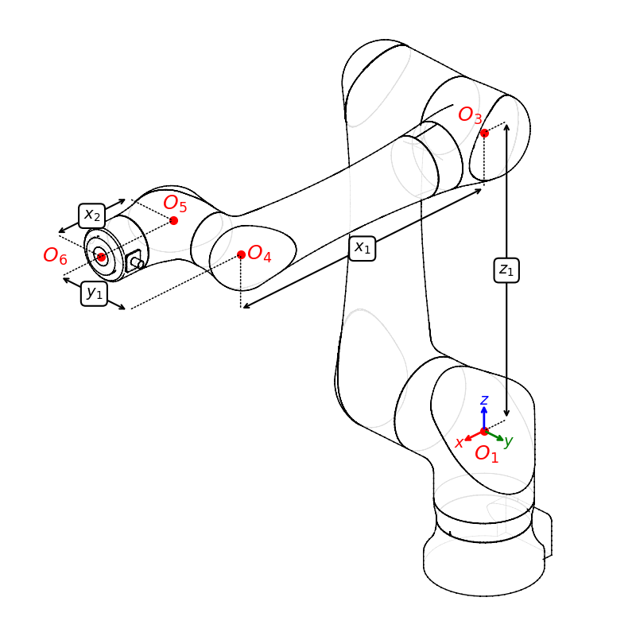

# Alternate Method

## Derivation of an Alternate Solution

### Constraints on a Solution

For any solution to be valid, it must satisfy all the following geometric constraints:

|   | Constraint                                                                                                           | Explanation                                                                                                                                                                                                                                              |
|---|----------------------------------------------------------------------------------------------------------------------|----------------------------------------------------------------------------------------------------------------------------------------------------------------------------------------------------------------------------------------------------------|
| A | The distance from $O_3$ to $O_1$ must be equal to $z_1$                                                              | This distance is controlled by Link 2, a single rigid body.                                                                                                                                                                                              |
| B | The distance from $O_3$ to $O_4$ must be equal to $x_1$                                                              | This distance is controlled by Link 3 and Link 4, and the distance does not change with $\overrightarrow{J_4}$ rotation.                                                                                                                                 |
| C | The distance from $O_4$ to $O_5$ must be equal to $y_1$                                                              | This distance is controlled by Link 4 and Link 5, and the distance does not change with $\overrightarrow{J_5}$ rotation.                                                                                                                                 |
| D | The cross-product of the vectors $\overrightarrow{O_1O_3}$ and $\overrightarrow{O_1O_4}$ have a z component of zero. | Because of how the robot is constructed, no matter how $\overrightarrow{J_1}$, $\overrightarrow{J_2}$, $\overrightarrow{J_3}$, and $\overrightarrow{J_4}$ rotate, $O_1$, $O_3$, and $O_4$ are always in the same vertical plane containing the $Z$ axis. |
| E | The vectors $\overrightarrow{O_4O_5}$ and $\overrightarrow{O_4O_3}$ are perpendicular.                               | Link 4 and Link 5 are constructed at a right angle.                                                                                                                                                                                                      |

### Initial Problem Setup

From the known geometric constraints, we can start to put together an intuition for the physical layout of the inverse kinemeatics problem.

First, during inverse kinematics, we are supplied a desired coordinate frame (isometry) at the end of the robot flange.  Thus, the frame of the last link is already known. This also means that the _origin_ of the 5th kinematic frame, $O_5$, is also known.

Working backwards from the robot flange, Link 5 is the next link, connected to the flange through $\overrightarrow{J_6}$. This joint is aligned with the axis of the flange, and as it rotates, the position of $O_4$ will trace a single circle in space around $O_5$. This circle is the set of all possible locations of $O_4$ that do not violate Constraint C for the desired IK solution. This is one of the key insights of Abbes and Poisson.

We notice that, because of Constraint E, the distance between $O_5$ and $O_3$ is also constant, with a value of $\sqrt{x_1^2 + y_1^2}$. This means that the position of $O_3$ must, by definition, lie on the surface of a sphere centered around $O_5$.

However, $O_3$ must also be a fixed distance from $O_1$ because of Constraint A, so its position must also lie on the surface of a sphere with radius $z_1$ centered at $O_1$ (the world origin). To satisfy both Constraint A and Constraint E simultaneously, the set of possible $O_3$ points is the intersection of these two spheres, which is a circle centered on, and perpendicular to, the vector $\overrightarrow{O_1 O_5}$.

At this point we've run out of easy geometric simplifications. We have the circle $\mathcal{C}_4$ containing possible candidates for $O_4$ and another circle $\mathcal{C}_3$ containing possible candidates for $O_3$.

$$ O_3 \in \mathcal{C}_3 $$
$$ O_4 \in \mathcal{C}_4 $$

The relationship between possible values of $O_3$ and $O_4$ is the distance Constraint B, specifying that they must be $x_1$ apart, and the plane constraint D which forces $O_3$ and $O_4$ to be in a single plane containing the $Z$ axis.  To go further, we must be able to match points between $C_3$ and $C_4$ and check their cross-products, searching for zeros.

### The $O_4$ to $O_3$ Matching Problem

For any candidate point $\hat{O}_4$ there are zero, one, or two possible points in $\mathcal{C}_3$ that may satisfy both the distance Constraint B and the perpinducualrity Constraint E. Geometrically we can think of this as creating a plane containing $\hat{O}_4$, with a normal of $\overrightarrow{O_5 \hat{O}_4}$ and taking its intersection with circle $\mathcal{C}_3$. 

The problem of finding valid pairs $(O_3, O_4)$ will eventually become a computational search. We could naively begin a very dense check of points in $\mathcal{C}_4$ using plane intersections with $\mathcal{C}_3$ and try to identify pairs that satisfy the planar Constraint D. However, at this point we do not fully understand the behavior of the relation, and so we do not know how dense that search would need to be.

