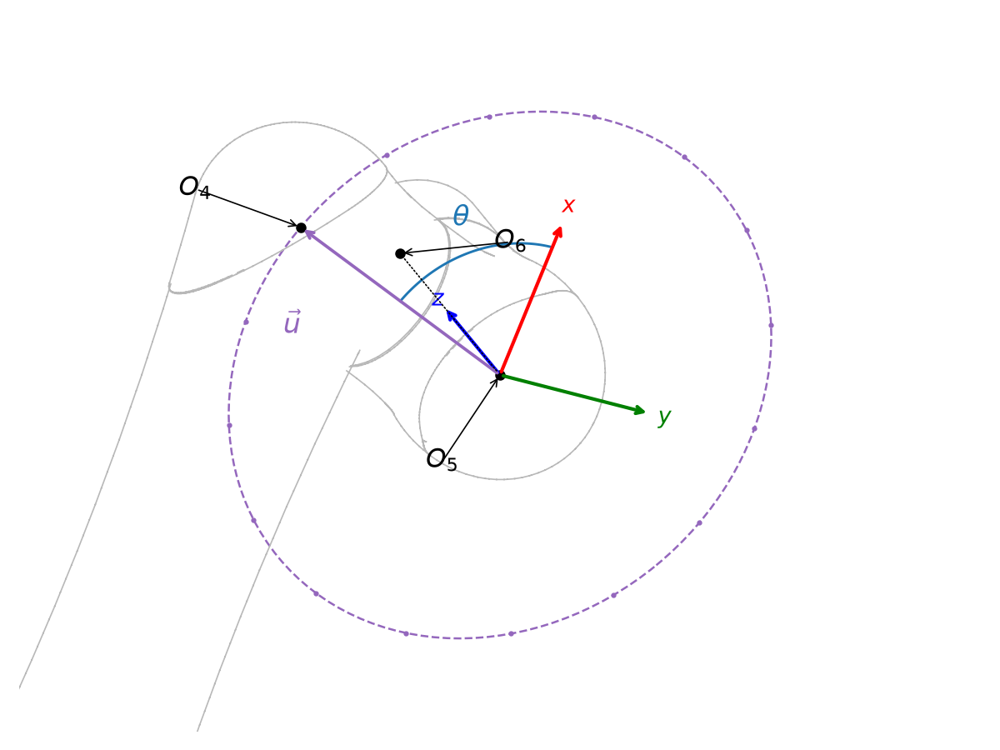
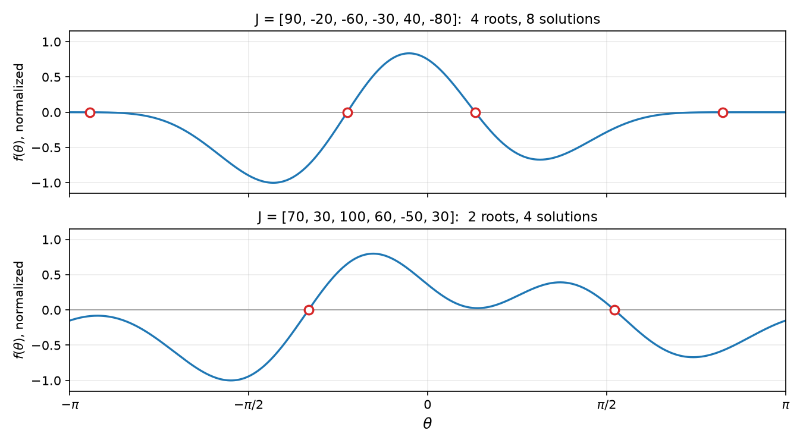
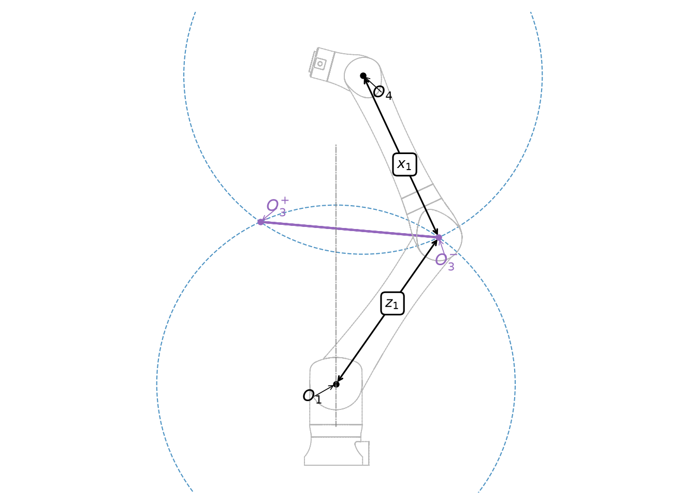
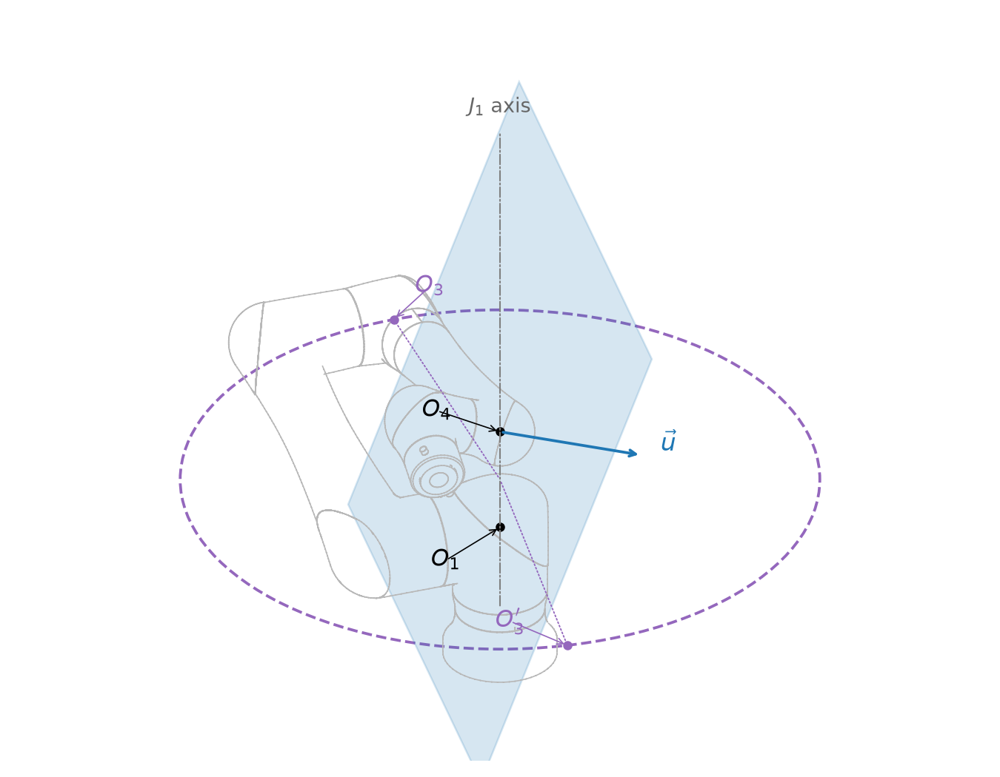

# The Linear Method

A complete inverse kinematics method for the FANUC CRX family. The reference implementation is
`derivation/crx/ik_reference.py`, and this document is the derivation behind it.


## Reduction of the problem

The target pose fixes the flange frame, and with it two of the six kinematic origins. $O_6$ is the
flange origin itself. $O_5$ is a pure offset back along the flange axis by $x_2$, and $J_6$ turns
about that axis, so rotating $J_6$ does not move it. The third fixed point is $O_1$, the world
origin, which no joint moves.

Therefore, the inverse kinematics problem consists of locating $O_3$ and $O_4$.
Once those two points are known, every joint angle can be read off the chain in turn.

The constraints available are the same ones the earlier work in [ALTERNATE.md](ALTERNATE.md)
identified:

|   | Constraint                                                       | Why it holds                                    |
|---|------------------------------------------------------------------|-------------------------------------------------|
| A | $\lvert O_1 O_3 \rvert = z_1$                                    | Link 2 is one rigid body                        |
| B | $\lvert O_3 O_4 \rvert = x_1$                                    | $J_4$ rotation does not change this distance    |
| C | $\lvert O_4 O_5 \rvert = y_1$                                    | $J_5$ rotation does not change this distance    |
| D | $O_1$, $O_3$, $O_4$ lie in one vertical plane                    | $J_1$ is the only joint that leaves that plane  |
| E | $\overrightarrow{O_4 O_5} \perp \overrightarrow{O_4 O_3}$        | Link 4 and link 5 meet at a right angle         |

## One free parameter

Constraint C says that $O_4$ lies on a circle of radius $y_1$ centered on $O_5$ in the flange
plane. The Abbes and Poisson paper begins with this observation. Parameterize the circle by
$\theta$, measured from the flange $\hat{x}$ axis:

$$ \vec{u}(\theta) = \cos\theta \, \hat{x}_{flange} + \sin\theta \, \hat{y}_{flange} $$

$$ O_4(\theta) = O_5 + y_1 \vec{u}(\theta) $$

The vector $\vec{u}$ is a unit vector along the $J_5$ axis, so it appears in constraint E as well
as in the position of $O_4$. One scalar unknown now stands for the whole problem.



*The flange axes are drawn at $O_5$, where the circle of candidates is centered. $\theta$ is
measured from the flange $\hat{x}$, and $\vec{u}$ points from $O_5$ to the $O_4$ it selects.*

## Linear constraints

With $\theta$ fixed, three of the five constraints are **linear in $O_3$**:

$$ \text{B with A:} \quad O_3 \cdot O_4 = \tfrac{1}{2}\left(z_1^2 + \lvert O_4 \rvert^2 - x_1^2\right) $$

$$ \text{E:} \quad O_3 \cdot \vec{u} = O_4 \cdot \vec{u} $$

$$ \text{D:} \quad O_3 \cdot \vec{w} = 0, \qquad \vec{w} = \hat{z} \times O_4 $$

The first comes from expanding $\lvert O_3 - O_4 \rvert^2 = x_1^2$ and substituting $\lvert O_3
\rvert^2 = z_1^2$. The third says $O_3$ lies in the vertical plane through $O_1$ and $O_4$, whose
normal is $\vec{w}$.

Cramer's rule gives one solution for the three linear equations in three unknowns:

$$ O_3 = \frac{\vec{N}(\theta)}{\Delta(\theta)}, \qquad
   \vec{N} = r_0 \, (\vec{u} \times \vec{w}) + r_1 \, (\vec{w} \times O_4), \qquad
   \Delta = O_4 \cdot (\vec{u} \times \vec{w}) $$

where $r_0$ and $r_1$ are the right hand sides of the first two equations above.

Every constraint has now been used except A. Imposing it leaves a single scalar equation in a
single unknown:

$$ f(\theta) = \lvert \vec{N}(\theta) \rvert^2 - z_1^2 \, \Delta(\theta)^2 = 0 $$

This scalar equation completes the reduction. It eliminates circle-to-circle matching, tracking
of clockwise and counterclockwise branch pairs, and searches over a reduced problem space.

## Polynomial degree and the limit of sixteen solutions

$f$ is a trigonometric polynomial in $\theta$: a finite sum of $\cos k\theta$ and $\sin k\theta$.
Counting degrees through the expressions above gives an upper bound greater than four. The surplus
terms cancel, giving an actual degree of **four**. Sampling $f$ at 32 angles and taking the discrete
Fourier transform confirms the cancellation: coefficients above $k = 4$ are zero to the last bit.
For one arbitrary CRX-10iA pose, normalized against the largest coefficient:

| $k$ | 0 | 1 | 2 | 3 | 4 | 5 | 6 | 7 |
|---|---|---|---|---|---|---|---|---|
| relative magnitude | 1.0 | 0.56 | 1.0 | 0.51 | 0.36 | 7e-17 | 1e-16 | 8e-17 |

`test_trigonometric_degree_is_four` checks this property on every model in the family. If a future
CRX model violates it, the solution count also changes.

A trigonometric polynomial of degree $d$ has at most $2d$ zeros in a full turn, so $f$ has at most
eight roots. Each root fixes $O_4$, and through it a single $O_3$, hence a single arm posture. Each
posture is reached two ways, because swinging the base half a turn and mirroring $J_2$, $J_3$, and
$J_4$ leaves the flange exactly where it was:

$$ J_1 \to J_1 - \pi, \quad J_2 \to -J_2, \quad J_3' \to \pi - J_3', \quad J_4 \to J_4 - \pi $$

Here $J_3'$ is the kinematic rotation of the third joint, which on a FANUC arm is the controller
value plus $J_2$, because driving $J_2$ carries the forearm with it.

Eight roots with two postures each give the literature's bound of sixteen for this architecture.
This derivation factors out the base flip and requires only eight roots. By comparison, the general
algebraic method from Raghavan and Roth and the subsequent CRX-specific work produce a univariate
polynomial of degree sixteen.

Over 720 random poses spread across all six models, the observed counts were:

| solutions | 4 | 8 | 12 | 16 |
|---|---|---|---|---|
| poses | 51 | 586 | 74 | 9 |



*$f$ over a full turn for two CRX-10iA poses, normalized to its own largest value in each panel.
Four roots above and two below, which the base flip doubles into eight and four solutions.*

## Root calculation

Because the degree is known, the nine Fourier coefficients of $f$ are recovered **exactly** from 16
evenly spaced samples. Sixteen exceeds the nine required coefficients, is a power of two, and puts
the first aliased harmonic at $k = 12$, far above anything present. After those 16 evaluations the
subsequent calculations evaluate $f$ and $f'$ from the coefficients without using the geometry.

The roots then follow from an ordinary polynomial solve. Substituting the half-angle variable
$t = \tan(\theta/2)$, so that

$$ e^{i\theta} = \frac{(1 + it)^2}{1 + t^2} $$

and clearing the denominator with a factor of $(1 + t^2)^4$ turns the trigonometric polynomial into
a real polynomial of degree eight:

$$ (1+t^2)^4 f(\theta) = c_0 (1+t^2)^4 + 2\,\mathrm{Re} \sum_{k=1}^{4} c_k (1+it)^{2k} (1+t^2)^{4-k} $$

Its real roots are the roots of $f$, and its companion matrix is real and $8 \times 8$. The
substitution sends $\theta = \pi$ to $t = \infty$, so the angular origin is first shifted to put
$\theta = \pi$ where $\lvert f \rvert$ is largest, which guarantees no root is lost off the end.

The reference implementation calls `numpy.roots`. The Rust port will build the companion matrix and
calculate its eigenvalues with `nalgebra::linalg::Schur`. Both approaches provide a finite,
complete calculation without sampling or bracketing, so roots cannot fall between samples.

## Rebuilding $O_3$ geometrically

Cramer's rule gives $O_3$ as $\vec{N}/\Delta$. The implementation reconstructs $O_3$ geometrically
because this quotient becomes $0/0$ where two solutions merge: $\Delta$ and $\vec{N}$ approach zero
together.

$O_3$ is rebuilt from the geometry that produced it. With $O_4$ known, constraints A and B put
$O_3$ on both a sphere of radius $z_1$ about $O_1$ and a sphere of radius $x_1$ about $O_4$, which
meet in a circle. Constraint D confines $O_3$ to the vertical plane through $O_4$, which cuts that
circle at two points. Call them the two **branches**, $O_3^{+}$ and $O_3^{-}$.



*Looking square at the vertical plane, so the two spheres show as great circles and the circle they
meet on is seen edge-on. Its two ends are the branches. The dimensions mark constraints A and B.*

Constraint E then decides between them, and its residual

$$ g_{\pm}(\theta) = \frac{\left(O_3^{\pm}(\theta) - O_4(\theta)\right) \cdot \vec{u}(\theta)}{x_1} $$

is used to polish each candidate angle. Where $f$ has a double root, $g_{+}$ and $g_{-}$ each cross
zero cleanly. Newton's method therefore converges at its usual rate and separates the two merged
solutions.

## Finishing in joint space

Every candidate ends with a few Gauss-Newton steps on the joint vector itself, against the twelve
elements of the rotation and translation blocks of the target, with the Jacobian taken by finite
difference of the forward kinematics.

This step improves accuracy near a merged pair, where $\theta$ is poorly determined while the joint
angles remain well determined. Solutions that otherwise stall around a tenth of a micron reach the
last digits of double precision. Across more than 600 random poses for all six models, the worst
pose error of any returned solution was $9 \times 10^{-13}$ mm.

The step also permits **acceptance based directly on pose error**. Real solutions converge to the
floor of double precision, while invalid candidates remain well above it. The $10^{-8}$ mm
threshold lies far above the error of a valid solution and far below the error that an invalid
candidate can reach. This gap permits broad candidate-generation criteria. Invalid candidates cost
only a few Gauss-Newton steps, while omitted solutions cannot be recovered later.

## Degenerate configurations

All of these configurations are ordinary poses, or attempted poses, that a real robot must handle.
They are degenerate in the mathematical sense.

| Configuration | What breaks | Treatment |
|---|---|---|
| Target out of reach | no real roots | return nothing |
| $J_4 = 0$, elbow pair merged | $f$ has a double root, which floating point splits into a near-conjugate pair | loose tolerance on the imaginary part; guarded Newton; per-branch polish on $g_\pm$ |
| Arm fully stretched, $O_1$, $O_3$, $O_4$ collinear | spheres tangent, so the intersection circle has zero radius and rounding can take it below zero | clamp the radius at zero and judge by pose error |
| $O_4$ on the $J_1$ axis | $\vec{w} = 0$, constraint D says nothing, $f$ has a double root | find the angle directly; rebuild $O_3$ on its horizontal circle; take $J_1$ from $O_3$ |
| $O_4$ near the $J_1$ axis | the vertical plane still exists but swings through a wide arc as $O_4$ moves past | same treatment, selected by a distance test that also detects near misses |
| $O_3$ and $O_4$ both on the axis | $J_1$ is free and the solution set is a continuum | report one representative, marked `SINGULAR_FAMILY` |
| $O_4$ on $O_1$ | the two spheres are concentric, so they coincide or miss entirely | report one representative when $z_1 = x_1$, otherwise nothing |
| $O_4$ *near* $O_1$ | the circle of candidates stays large while its plane becomes undetermined | not recoverable; see below |
| $O_4$ on the axis at $\lvert z_1 - x_1 \rvert$ | the circle of candidates collapses to a point | not recoverable; see below |
| $J_5 = 0$, wrist singular | $J_4$ and $J_6$ trade against each other with no effect on the pose | the polish reaches one configuration from several directions; duplicate detection merges them |

The following sections explain the axis degeneracy, the numerical treatment of double roots, and
the configurations that leave the base angle free.

### $O_4$ on the $J_1$ axis

This is the case behind
[issue #1](https://github.com/mattj23/crx-kinematics/issues/1). On a CRX-10iA at
$[10, -80, 10, 20, -20, 45]$, $O_4$ lands at $(0, 0, 187.54)$, exactly on the axis. It happens
whenever the kinematic $J_3$ rotation is a quarter turn from $J_2$, which in controller terms is
$J_3 = J_2 + 90$. Operators can enter this configuration directly, so it occurs more frequently
than a random distribution would suggest.

Two things break at the same time: the vertical plane through $O_1$ and $O_4$ has no defined orientation,
so constraint D provides no information and $f$ has a double root. In addition, $O_4$ has no azimuth
from which to calculate $J_1$.

The solver uses the elliptical shadow of the $O_4$ circle on the floor to find the axis crossing.
The squared distance from $O_4$ to the axis is a trigonometric polynomial of degree two with at most
two minima, found by applying Newton's method from a small set of starting points. At a qualifying
angle, the solver reconstructs $O_3$ as the intersection of its horizontal circle and the plane
perpendicular to $\vec{u}$. This produces two points, and the azimuth of $O_3$ determines $J_1$.

A *distance* test detects both crossings and near misses. A pose that misses the axis by a
nanometer causes the same difficulty for the branch construction as a pose that hits it. The
solver handles both by putting $O_4$ on the axis, constructing $O_3$ there, and using the joint
polish to absorb the ignored nanometer.

This axis-specific construction returns all sixteen solutions for the issue #1 pose, including the
joint values that produced it.



*With $O_4$ on the axis, every point of the horizontal circle satisfies constraints A and B, while
constraint D provides no additional restriction. The plane perpendicular to $\vec{u}$ cuts the
circle at two points, and the azimuth of each, drawn as the dotted radii, gives $J_1$.*

### Double roots

In floating-point arithmetic, a double root of $f$ splits into a conjugate pair whose imaginary
part is approximately the *square root* of the rounding error. The tolerance that classifies a root
as real must therefore be loose by several orders of magnitude and is set to a relative value of
$10^{-2}$. The final pose check removes any invalid candidates admitted by this tolerance.

Because rounding controls the ratio between the value and slope of $f$ near a double root, the
polish uses two guards. The implementation rejects a Newton step longer than the cap and undoes a
step that does not reduce $\lvert f \rvert$. These guards prevent a valid polynomial root from
moving onto its neighbor and being lost when duplicate roots are merged.

### The free base angle

Two poses leave $J_1$ free. If $O_3$ and $O_4$ are both on the axis, the whole arm is
upright and turning the base only turns the arm about its own centerline, which $J_4$ can undo. If
$O_4$ lands on $O_1$ itself, which happens only on the models built with $z_1 = x_1$ (the CRX-3iA
and the CRX-10iA), the two spheres that locate $O_3$ become concentric and both $J_1$ and $J_2$
lose their effect.

Each case has a continuous solution set. The solver returns and marks one representative. A caller
can recognize the mark and substitute a suitable base angle.


### Unrecoverable configurations

For each degenerate geometry above, the solver treats a nearby configuration as the corresponding
mathematical case because the joint polish absorbs the small resulting error. Two configurations
remain unrecoverable because the plane used to slice the circle of candidate $O_3$ points does not
intersect that circle transversally.

**The circle collapses.** With $O_4$ on the axis at a distance $\lvert z_1 - x_1 \rvert$ from the
origin, the two spheres locating $O_3$ are tangent and their circle has no extent. The arm is
folded back on itself with the wrist center on the base axis. The collapsed circle leaves $O_3$'s
position around the circle undetermined.

**The circle remains large while its plane becomes unstable.** When $O_4$ is within a fraction of a
millimeter of the origin, the circle still has a radius of half a meter. This condition requires
$z_1 = x_1$ and therefore occurs only on the CRX-3iA and the CRX-10iA. The direction of $O_4$
determines the plane containing the circle, and that direction is weakly determined near the
origin. Consequently, an error in $O_4$ far below a micron moves $O_3$ by hundreds of millimeters.

In both cases, the solver returns solutions that reach the requested pose without recovering the
particular configuration that produced it. A real arm cannot reach either configuration because
both place the wrist center inside the robot's base casting. The test suites deliberately exclude
them using the two measurements described here.

## Cost

Per target pose:

| Step | Cost |
|---|---|
| Fourier coefficients of $f$ | 16 evaluations of the geometry |
| Roots | one $8 \times 8$ eigenvalue problem |
| Branch polish | up to 16 short Newton solves |
| Joint polish and check | up to 16 forward kinematics chains, a few times each |

The cost of each listed step is independent of tolerance, and none of the steps sample a search
space. The NumPy reference runs in approximately 80 ms per pose. The finite-difference Jacobians
for the joint polish account for almost all of that time. The Rust implementation should be several
orders of magnitude faster.

## Reading the reference implementation

| Section of this document | Where it lives |
|---|---|
| The one free parameter | `Setup.o4_and_axis` |
| The linear system and $f$ | `Setup.f` |
| Degree and Fourier coefficients | `dft_coefficients`, `eval_f`, `TRIG_DEGREE` |
| Half-angle polynomial and roots | `half_angle_polynomial`, `theta_roots` |
| Branches of $O_3$ | `Setup.circle_of_o3`, `Setup.o3_branch`, `Setup.branch_residual`, `polish_branch` |
| On the axis | `Setup.axis_distance`, `Setup.axis_thetas`, `Setup.o3_on_axis` |
| Free base angle | `Setup.is_singular_family`, `Setup.is_on_origin`, `Setup.o3_on_origin` |
| Reading off the joints | `joints_from_points`, `alternate_pair` |
| Joint polish and acceptance | `polish_joints`, `ik` |

## Regenerating the figures

The figures above are drawn by `crx.figures` in the derivation project, one module per figure. From
`derivation/`, with its virtual environment active:

```bash
python -m crx.figures
```

Each figure poses a CRX-10iA through `crx.robot.Robot` and obtains its geometry from
`crx.ik_reference`. Assertions executed during drawing detect a construction that no longer matches
the solver. The older diagrams in `images/` predate this tooling and cannot be reproduced with it.
